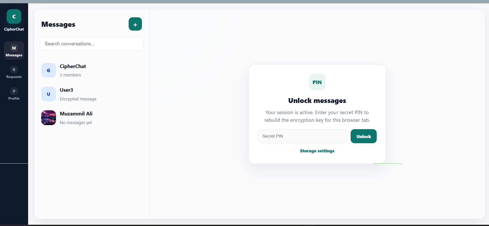
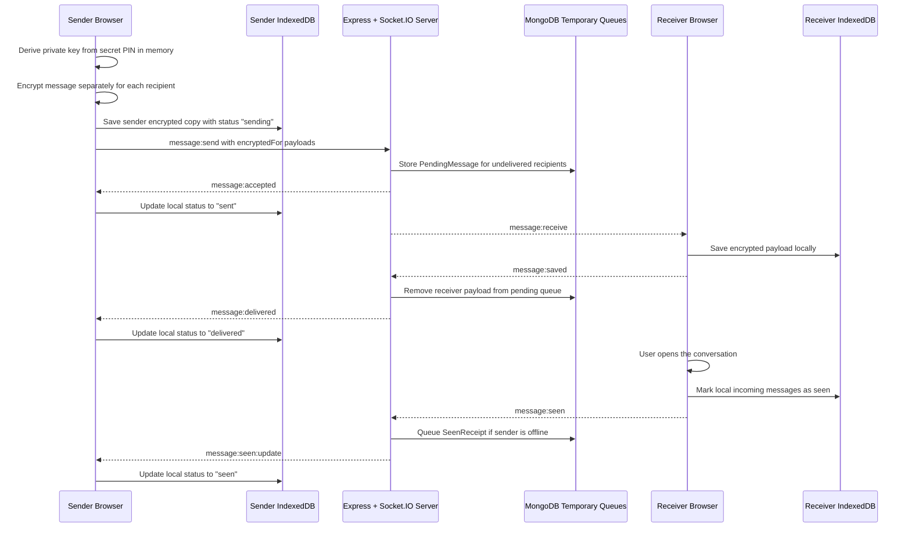
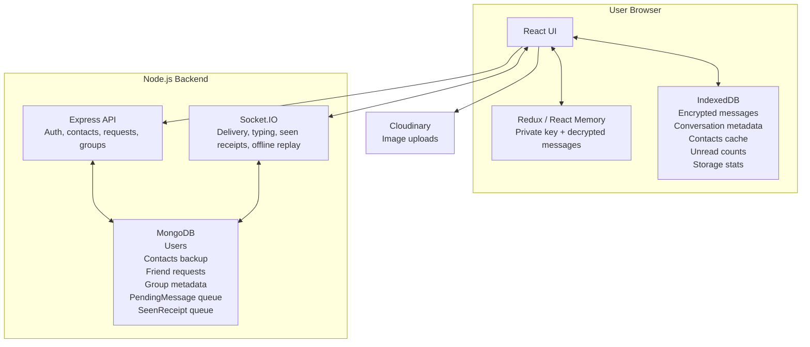

# CipherChat

CipherChat is an encrypted real-time chat application with local-first message storage, cookie-based authentication, group messaging, media sharing, and sent/delivered/seen delivery states.

The project is designed to show practical full-stack engineering depth: secure auth, Socket.IO event flows, client-side encryption, browser IndexedDB persistence, temporary server delivery queues, and clear separation between local private data and server-owned metadata.

## Preview



The screenshot slot above is reserved for the current CipherChat dashboard view: locked message state, encrypted sidebar previews, and the storage settings entry point.

## Highlights

- Cookie JWT authentication with protected API routes.
- PIN-derived client-side encryption key kept in browser memory only.
- Per-recipient encrypted message payloads for direct and group conversations.
- Local-first encrypted message history stored in IndexedDB.
- Temporary MongoDB delivery queue for offline encrypted message delivery.
- Sent, delivered, and seen message states over Socket.IO.
- Group chat with member-aware encryption and delivery tracking.
- Local storage settings for encrypted chat data management.
- Friend requests, contacts backup, profile updates, typing indicators, image messages, and online status.

## Tech Stack

- Frontend: React, Vite, Redux Toolkit, React Router, Socket.IO Client.
- Backend: Node.js, Express, Socket.IO.
- Database: MongoDB with Mongoose.
- Browser storage: IndexedDB for encrypted local message history.
- Auth: JWT stored in an `httpOnly` cookie.
- Media: Cloudinary uploads.
- Crypto: PIN-derived ECDH key pair plus AES-encrypted payloads.

## Architecture

### Message Encryption, Delivery, and Seen Flow



Decrypted message content is only produced in React memory after the user unlocks messages with the secret PIN. Decrypted text or image payloads are not written back to IndexedDB.

### IndexedDB vs Server Responsibilities



Permanent chat history is browser-local. The server stores users, contacts, requests, groups, public keys, online presence, and temporary delivery/seen queues so messages can reach offline users without becoming permanent server-side history.

## Core Data Flow

- Login/signup sets a JWT cookie; protected APIs derive the user from the verified cookie.
- The secret PIN rebuilds the ECDH private key in memory after refresh.
- Sending a message creates encrypted payloads for all active recipients.
- The sender stores its encrypted copy locally before the server acknowledges the send.
- The server stores only temporary encrypted payloads for recipients who still need delivery.
- The receiver saves the encrypted payload in IndexedDB and acknowledges local persistence.
- Delivery and seen receipts update sender-side local metadata.
- Unread counts are local IndexedDB metadata, not server-owned counters.

## Local Setup

### Backend

```bash
cd backend
npm install
npm run dev
```

Run backend tests:

```bash
cd backend
npm test
```

### Frontend

```bash
cd frontend
npm install
npm run dev
```

Build frontend:

```bash
cd frontend
npm run build
```

## Environment Variables

Create `backend/.env` from `backend/.env.example`:

```env
PORT=3000
NODE_ENV=development
FRONTEND_ORIGIN=http://localhost:5173
MONGO_URI=mongodb://127.0.0.1:27017/chatApp
ACCESS_TOKEN_SECRET=replace-with-a-long-random-secret
ACCESS_TOKEN_EXP=1d
ACCESS_TOKEN_COOKIE_MAX_AGE_MS=86400000
CLOUD_NAME=your-cloudinary-cloud
CLOUDINARY_API_KEY=your-cloudinary-api-key
CLOUDINARY_API_SECRET=your-cloudinary-api-secret
```

Create `frontend/.env` from `frontend/.env.example`:

```env
VITE_API_URL=http://localhost:3000
VITE_CLOUDINARY_CLOUD_NAME=your-cloudinary-cloud
VITE_CLOUDINARY_UPLOAD_PRESET=your-upload-preset
```

## Project Structure

```text
backend/
  src/
    connections/       MongoDB, Cloudinary, Socket.IO setup
    controllers/       Auth, users, conversations, messages
    models/            Users, contacts, groups, requests, queues
    routes/            Express routes
    utils/             JWT, chat helpers, tests

frontend/
  src/
    components/        App pages and chat UI
    hooks/             Socket lifecycle hook
    services/          API, encryption, IndexedDB, uploads
    store/             Redux state
    styles/            CSS modules
```

## Current Limitations

- Message history is per browser. Clearing browser storage removes local chat history.
- Linked devices are not implemented yet; a new device only receives future messages after it connects.
- Group admin controls such as rename group, remove member, and invite links are not included.
- This project should be deployed and smoke-tested in production before being treated as production-ready.

## Resume Summary

Built CipherChat, an encrypted real-time chat app with cookie JWT auth, IndexedDB-based local encrypted message storage, offline delivery queues, group chats, image sharing, and sent/delivered/seen receipts using React, Node.js, Socket.IO, MongoDB, and client-side encryption.
