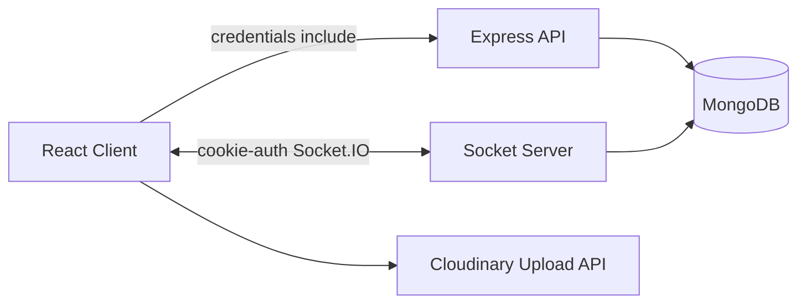

# ChatApp

ChatApp is a MERN real-time messaging application with direct chats, encrypted group chats, friend requests, online presence, typing indicators, unread counts, profile photos, and image messages.

## Tech Stack

- React, Vite, Redux Toolkit, React Router
- Node.js, Express, Socket.IO
- MongoDB, Mongoose
- JWT cookie authentication
- Cloudinary image upload
- Client-side ECDH + AES message encryption

## Features

- Signup/login with a single JWT stored in an `httpOnly` cookie.
- Protected routes authorize users from the verified cookie, not frontend-provided user data.
- Direct chat between accepted contacts.
- Basic group chat: create group, add initial members, view member count, send messages, leave group.
- Per-recipient encrypted message payloads for group chat.
- Real-time message delivery through Socket.IO.
- Cursor-based message history loading.
- Unread counts, online status, and typing indicator.

## Architecture

## Local Setup

1. Copy env files:
   - `backend/.env.example` to `backend/.env`
   - `frontend/.env.example` to `frontend/.env`
2. Install dependencies in both folders:
   - `npm install`
3. Start MongoDB locally.
4. Start backend:
   - `cd backend`
   - `npm run dev`
5. Start frontend:
   - `cd frontend`
   - `npm run dev`

## Security Notes
- When the JWT cookie expires, the user must login again.
- Group messages are encrypted separately for each active group member.
- The secret PIN is required to derive the client-side private key. If the page refreshes and the key is gone from memory, the user should login again with the PIN to decrypt messages.

## Known Limitations

- No group admin roles, rename group, remove member, invite links, or read receipts yet.
- Existing old messages are read through a compatibility path, but new messages use the normalized conversation schema.
- Password update UI is present but not implemented.
- More automated tests should be added before production deployment.
